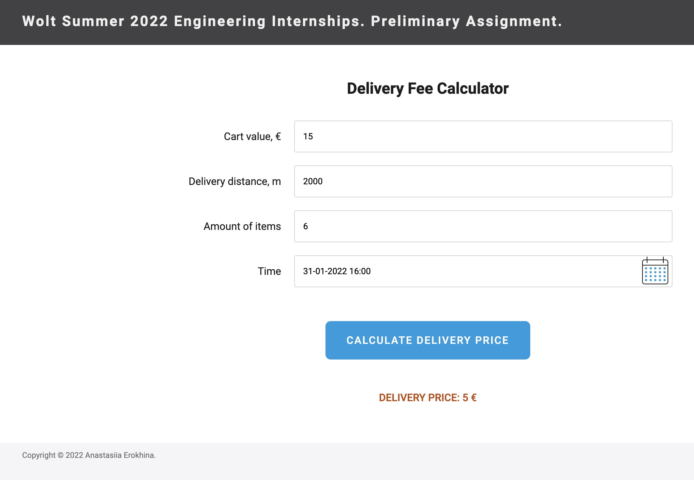
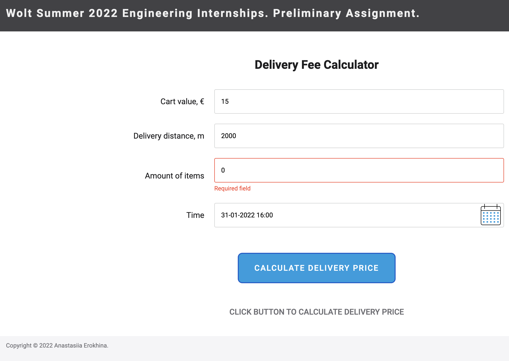

## Wolt Summer 2022 Engineering Internships. Preliminary Assignment by Anastasiia Erokhina

This is a Frontend assignment for Wolt's Summer 2002 Engineering internship - a delivery fee calculator. User enters the order value, delivery distance, the number of items and time of the order. The calculator then outputs how much the delivery will cost. All fields are treated as required and the calculator will show an error if any of the fields is empty or zero.

Full description of the assignment can be found in the [assignment repository](https://github.com/woltapp/engineering-summer-intern-2022).

My solution is written in TypeScript and uses React.js + Redux. Even though Redux may be an overkill for such a small app, I've decided to use it for the sake it being a test assignment.

### Prerequisites

- [Docker](https://www.docker.com/)

### Running the project

To start the project clone the repository and then run `build_and_start.sh` script in the root of the repo. The script will check if Docker is installed, then build the image (running unit tests in the process) and start the app in interactive mode. The app will be exposed at http://localhost:3000. To stop the app press <kbd>Ctrl</kdb> + <kbd>C</kbd>. Built Docker images are tagged as `aerokhina-wolt-2022`.
